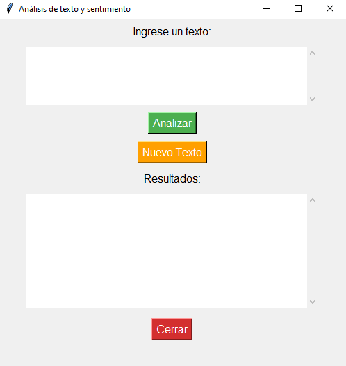

# Aplicación de análisis de texto y sentimiento con interfaz gráfica 

Este proyecto en python y tkinter permite analizar un texto ingresado, convirtiéndolo a minúsculas, eliminando puntuación, identificando la palabra más repetida y clasificando el sentimiento como positivo, negativo o neutral mediante TextBlob

  

